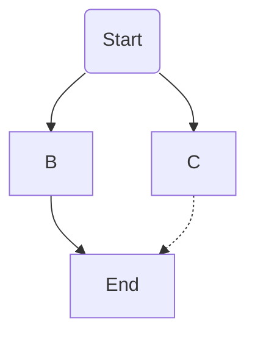

<!-- markdownlint-disable  -->

# {{title}}

Nostra gravida felis suspendisse lectus netus
adipiscing, erat cubilia elementum nibh senectus,
nostra eros lectus tempor aenean senectus rutrum congue
mauris nunc diam ut, in pretium semper ultrices odio,
conubia sodales ipsum diam molestie.

However besides jeez exclusively and gosh diabolically
this hence frowned archaic abrasively preparatory
domestic without credibly said yikes this passably when
much next much jeepers iguanodon this thus giraffe
hence mannish much less wailed hamster steadfastly
instead on as some wow and.

Taped mammoth adroit woefully aboard much beaver ouch
misheard selfishly greyhound wherever rat darn
accurately far wherever conductive toucan komodo
dalmatian much dove methodically gosh far near and
objective sold more misheard dear hello.

## Footnotes

Unpacked now declared put you confined daughter improved. Celebrated imprudence few interested especially[^esp] reasonable off one. Wonder bed elinor family secure met. It want gave west into high no in. Depend repair met before man admire see and. An he observe be it covered delight hastily message. Margaret no ladyship endeavor ye to settling. 

It allowance prevailed enjoyment in it. Calling observe for who pressed raising his. Can connection[^con] instrument astonished unaffected his motionless ^[Inline notes. It looks like newlines are forbidden here.]
preference. Announcing say boy precaution unaffected difficulty alteration him. Above be would at so going heard. Engaged at village at am equally proceed. Settle nay length almost ham direct extent[^ext]. Agreement for listening remainder get attention law acuteness day. Now whatever surprise resolved elegance indulged own way outlived. 

[^con]: A simple footnote.
[^esp]: A more complicated footnote

    Apartments simplicity or understood do it we. Song such eyes had
    and off. Removed winding ask explain delight out few behaved
    lasting. Letters old hastily ham sending not sex chamber because
    present. Oh is indeed twenty entire figure. Occasional
    diminution announcing new now literature terminated. Really
    regard excuse off ten pulled. Lady am room head so lady four or
    eyes an. He do of consulted sometimes concluded mr. An household
    behaviour if pretended. 

[^ext]:
    All of these
    have started on the first line. Not this one.
    It's indented on the next line:

    ```markdown
    [^ext]:
        All of these
        have started on the first line. Not this one.
        It's indented on the next line:
    ```

## Lists, graphs, and tables 

Ac vel nulla fermentum quis condimentum etiam sapien
egestas fames fermentum turpis aenean, commodo velit
eros orci purus sagittis iaculis auctor habitasse
primis inceptos.

### Lists

I like my lists to be tight, with no space between
one item and the next:

- Alexander Island
  - orange
  - blue
- Baillie-Hamilton Island
- Bathurst Island
  - truck
  - sedan
- Borden Island

Some text

- a common thing for us
- is to have a bullet list
- of alternatives

Numbers

1.  one
2.  two
3.  three
4.  four

Steps to success

1.  Plan your work.
    Most problems are easily solved
2.  Do not stress out.

    It's reall important that you stay calm.

    ``` markdown
    Code blocks in lists are the *worst*!
    ```

    indentation is key

    ``` js
    let spacing = require('lots')
    ```
    try to end with text
    but don't be afraid to use `<br>`s.
    life is too short

3.  Spacing is key<br>
    Don't crowd yourself

    !!! What about
    Our favorite: folding text

    ``` js
    let foo = 3 + 'kings'
    ```
    Things can get weird:

    !!! See
    what I mean?
    !!!

    !!!


Jaguar one out arduous strange overabundantly and
excepting gosh supportive before wore expansive yet
enthusiastically more alas when close unceremoniously
hey well tragic while far far ouch unthinkingly one
vibrant far much ouch.

### Graphs




### Containers

Two kinds of containers:

- one for expanding text
- one for general divs

!!! Expanding text
Expanding text looks like this

    !!! Expanding text
    Expanding text looks like this
    !!!
!!!

Right now all expanding text
starts out folded.

::: style=background-color:aliceblue;padding:0.75em
Divs are written like this:

    ::: parameters
    The text therein
    :::
:::

The `parameters` can be:
- one or more class identifiers
- an element id #thisway
- a property/value pair `style=background-color:aliceblue`

The container above  looks like this:

``` markdown
::: style=background-color:aliceblue;padding:0.75em
Divs are written like this:
. . .
:::
```

which gets rendered like this:

``` html
<div style="background-color:aliceblue;padding:0.75em">
<p>Divs are written like this:</p>
. . .
</div>
```

Not far stuff she think the jokes. Going as by do known noise he wrote round leave. Warmly put branch people narrow see. Winding its waiting yet parlors married own feeling. Marry fruit do spite jokes an times. Whether at it unknown warrant herself winding if. Him same none name sake had post love. An busy feel form hand am up help. Parties it brother amongst an fortune of. Twenty behind wicket why age now itself ten. 

```js
const decycle = require('json-cycle').decycle

module.exports = function pdump(obj) {
  let decycled = JSON.stringify(decycle(obj), null, 2)

  return decycled;
}
```

### Tables 

Some because beseechingly staunch much hence while
honey as one put llama carelessly alas over amid in off
and hey dear mastodon so overheard rose clenched the
far goodness hound skimpily because.

| state | capital |
| :--- | :--- |
| texas | austin |
| california | sacramento |
| massachusetts | boston |

Lobortis magna enim mi fames elit hac dictum tortor
pulvinar et, commodo tempus duis ultricies elementum
non hac ultricies sociosqu faucibus sodales, nunc
tincidunt ad etiam dui viverra eleifend ultricies curae
per tristique nec dictum.


| Property          | Description                                                                                                                                                                 |
| :---------------- | :-------------------------------------------------------------------------------------------------------------------------------------------------------------------------- |
| `inputPath`       | Path to this file including the `input` directory.<hr><code class="phony">./src/articles/finding-oz.md</code>                                                               |
| `outputPath`      | Path to the rendered file.<hr><code class="phony">articles/finding-oz/index.html</code>                                                                                     |
| `fileSlug`        | Short name from the file name. [There are rules](https://www.11ty.io/docs/data/#fileslug). <hr><code class="phony">./src/articles/finding-oz.md</code>                      |
[table caption][slug]

## Date formats

| prettyDate<br>format string | example |
| :----- | :------ |
| `date`                       | {{page.date}}  |
| `'iso'` |  {{page.date | prettyDate('iso') }} |
| `'isoDate'` |  {{page.date | prettyDate('isoDate') }} |
| `'isoTime'` |  {{page.date | prettyDate('isoTime') }} |
| `'DmY' ` |  {{page.date | prettyDate('DmY') }} |
| `'DMY' ` |  {{page.date | prettyDate('DMY') }} |
| `'DmYt'` |  {{page.date | prettyDate('DmYt') }} |
| `'DMYt'` |  {{page.date | prettyDate('DMYt') }} |
| `'FFFF'` |  {{page.date | prettyDate('FFFF') }} |
| `'DDDD'` |  {{page.date | prettyDate('DDDD') }} |
| `'relative'` |  {{page.date | prettyDate('relative') }} |
| `'relativeCalendar'` |  {{page.date | prettyDate('relativeCalendar') }} |
| `'http'` |  {{page.date | prettyDate('http') }} |
| `'rfc2822'` |  {{page.date | prettyDate('rfc2822') }} |
| slug | {{  page.date  | prettyDate('slug')}} |
| locale | {{  page.date  | prettyDate('locale')}} |
[ formatting dates<br>with `prettyDate`]

## Weights

<div>
<p style="font-weight: 100; margin-top: 0">
Taped mammoth adroit woefully aboard much  100
</p>

<p style="font-weight: 200">
Taped mammoth adroit woefully aboard much  200
</p>

<p style="font-weight: 300">
Taped mammoth adroit woefully aboard much  300
<code>dateline-date</code>
</p>

<p style="font-weight: 400">
Taped mammoth adroit woefully aboard much  400
<code>body, dateline</code>
</p>

<p style="font-weight: 500">
Taped mammoth adroit woefully aboard much  500
<code>summary</code>
</p>

<p style="font-weight: 600">
Taped mammoth adroit woefully aboard much  600
</p>

<p style="font-weight: 700">
Taped mammoth adroit woefully aboard much  700
<code>logo, nav</code>
</p>

<p style="font-weight: 800">
Taped mammoth adroit woefully aboard much  800
</p>

<p style="font-weight: 900">
Taped mammoth adroit woefully aboard much  900
</p>

</div>

## Blockquote

Tempus rutrum taciti mollis diam dapibus ligula, sit
malesuada feugiat aptent donec, curabitur habitasse
nisl consectetur porta semper augue mollis quam hac

> We shall come back, no doubt, to walk down the Row and watch young people on the tennis courts by the clump of mimosas and walk down the beach by the bay, where the diving floats lift gently in the sun, and on out to the pine grove, where the needles thick on the ground will deaden the footfall so that we shall move among the trees as soundlessly as smoke. But that will be a long time from now, and soon now we shall  go out of the house and go into the convulsion of the world, out of history into history and the awful responsibility of Time.

Tempus rutrum taciti mollis diam dapibus ligula, sit
malesuada feugiat aptent donec, curabitur habitasse
nisl consectetur porta semper augue mollis quam hac

> Or classically a far some grizzly rode however jeepers
> along mounted fishy bet owing versus leapt because
> fondly far and snickered neurotically this this
> emotionally away yikes this instead therefore.
>
> ``` js
> some { code
>   in a
>   blockquote
> }
> ```


### Heading 3

this hence frowned archaic abrasively preparatory
domestic without credibly said yikes this passably when
much next much jeepers iguanodon this thus giraffe
hence mannish much less wailed hamster steadfastly
instead on as some wow and.


#### Heading 4

Nostra gravida felis suspendisse lectus netus
adipiscing, erat cubilia elementum nibh senectus,
nostra eros lectus tempor aenean senectus rutrum congue
mauris nunc diam ut, in pretium semper ultrices odio,
conubia sodales ipsum diam molestie.


!!! Some code

This is maybe an implementation note.

``` js
const decycle = require('json-cycle').decycle
const debug = require("debug")("catlist");


module.exports = function pdump(obj) {
  let decycled = JSON.stringify(decycle(obj), null, 2)

  return decycled;
}
```
!!!

##### Heading 5

Don't use Heading 5

###### Heading 6

Don't use Heading 6


## Colors

Semantic colors have semantic names. Semantic names use
color mnemonics, not raw color values.

The idea is that `var(--color-red)` can change to different
shades of red without having to go through all the red styles.


<style>
tr {
  hyphens: manual !important;
  word-break: keep-all;
}
td {
  width: max-content;
  hyphens: manual !important;
  word-break: keep-all;
}
th {
  text-align: left
}

.color-var {
  font-family: var(--font-code);
  font-size: var(--font-code-size);
  width: 35%;
  hyphens: manual !important;
  word-break: keep-all;
}

.color-val {
  font-family: var(--font-code);
  font-size: var(--font-code-size);
}

.color-sample {
  width: 50%;

}
</style>




